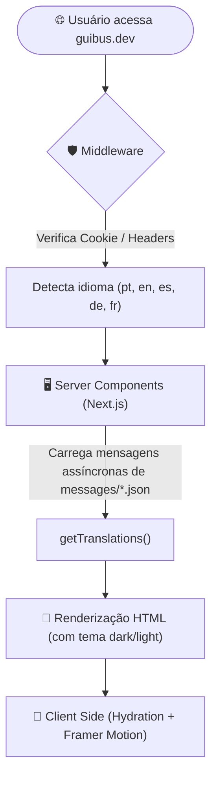

   
   
  

 

## 🌟 Visão Geral

Este repositório contém meu portfólio pessoal construído com Next.js 16 (App Router) e Tailwind CSS v4, apresentando projetos desenvolvidos, habilidades técnicas e métricas de contribuição no GitHub.

O projeto implementa uma arquitetura multilíngue sem prefixo na URL (`localePrefix: 'never'`), otimização estrita de assets e integração direta com dados de repositórios e linguagens.

## 🚀 Deploy & Demonstração

O projeto está implantado e disponível em:
👉 **[https://guibus.dev/](https://guibus.dev/)**

## 🛠️ Stack Tecnológica

  
  
  
  
  
  
  
  
  
  
  
  
  

---

## 🏛️ Arquitetura do Sistema

Fluxo de renderização e processamento de idioma utilizando Next.js App Router e o middleware do `next-intl` para entrega de conteúdo localizado sem prefixo de rota na URL:

---

## 🚀 Módulos da Aplicação

| Módulo                       | Descrição                                                                                                   | Detalhes Técnicos                                                                                                       |
| :--------------------------- | :---------------------------------------------------------------------------------------------------------- | :---------------------------------------------------------------------------------------------------------------------- |
| **🌐 Internacionalização**   | • Tradução completa em 5 idiomas • Rotas sem prefixo de locale • Detecção e cookies persistentes    | Gerenciamento de traduções feito com `next-intl`, com resolução dinâmica e transparente no middleware.                  |
| **🎨 Interface & Tema**       | • Tailwind CSS v4 • Componentes Shadcn/ui estruturados • Variáveis dinâmicas OKLCH                   | Layouts baseados em OKLCH com transição nativa de temas (claro/escuro) e estilização modular.                            |
| **📊 Integração GitHub**     | • Estatísticas em tempo real • Linguagens mais utilizadas • Gráfico de contribuições                 | Integração com a API REST do GitHub para consumo e exibição dinâmica dos dados do perfil.                               |
| **⚡ Animações & Gestos**     | • Transições de entrada fluidas • Micro-interações interativas nos cards                                | Implementações com `framer-motion` e `gsap` garantindo 60fps no carregamento e interação.                               |

